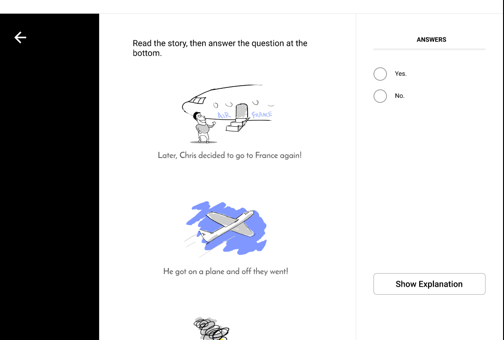
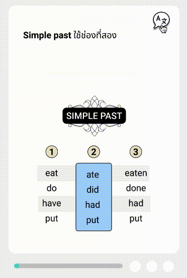
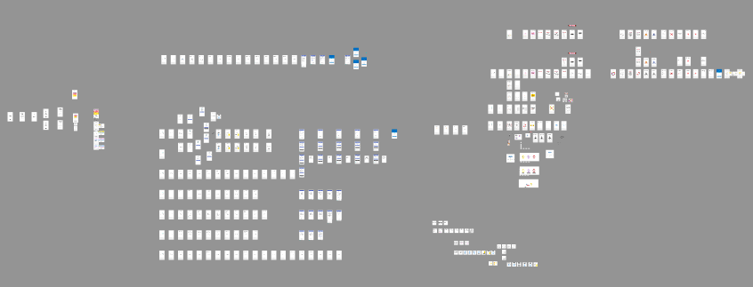
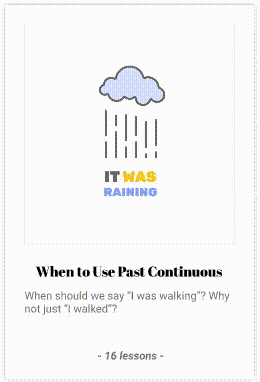

# ESL-app-research

## Overview
Over the course of 5 months, I conducted 40 interviews and prototyped 6-7 different designs for an app to teach intermediate to advanced ESL (English as a Second Language). These are things that might interest you:
- [Who](#who)
- [Why](#why)
- [Process/Philosophy](#process-and-philosophy)
- [Interview Format and Goals](#interview-format-and-goals)
- [Prototype Examples](#prototype-examples)
- [General Lessons about Product Discovery](#general-lessons-learned-about-product-discovery)
- [Findings and problems](#findings-and-problems)
- [Musings on Figma and computation](#musings-on-figma-and-computation)
  * [Combinatorial States in Figma](#Combinatorial-States-in-Figma)
  * [Abusing Auto-Animate to Animate...Anything](#abusing-auto-animate-to-animateanything)

## Who
I had been teaching ESL for ~8 years up to this point, especially with adults. Many users were contacts within immmigrant communities or abroad.
- Most were Brazilian or Thai
- Language used in interviews was English or Thai.
- Most interviewees were quite fluent in English, but still showed some persistent language errors as most adult language learners do.

## Why
- I had taught ESL for a long time and also learned languages as an adult, however in 2020 I became motivated to make an app to teach ESL because:
- Many ESL apps/resources are of questionable quality. Most language-learning apps (e.g. Duolingo) are trivial and/or lazily generalize to many different languages (and then not doing a good job of teaching any of them).
- The English-learning market far exceeds any other language. The amount that people want to learn Spanish, German, etc. pales in comparison to the number of people who want to learn English and the seriousness with which they endeavor to study it.
- I was impressed by Brilliant.org and other apps that taught math at a high level but in a fun, intuitive way.

## Process and Philosophy
I developed prototypes using Figma and Adobe XD, allowing myself no longer than 3 weeks for a given prototype (often times using just 1 week). I initially was very ambitious and wanted to have something to test with a user _every week_. This pace didn't last longer than a few weeks, but the spirit of rapid iteration and user testing was a strong theme for this project. 
My earlier programming projects in Java and Rust were complicated and not market-oriented. In other words they were personal projects that deeply intersted me and were not meant for commercial applications. 

At the beginning of this project, on the suggestion of friends, I read and was heavily influenced by two books: (1) Inspired (2) and Design Sprint. The biggest take-away fromt hese projects aws this: good product discovery comes from constant iteration with consistent testing with real users. <quote from inspired> 
  
While my overall philosophy was more inspired by Inspired, I also greatly enjoyed applying the workflow proposed in Sprint. This book basically introduced the concept of a design sprint, and while designed for teams, I found it extremely helpful in these ways: 
  - Emphasis on asking the big questions up front: what are biggest risks, why will this fail
  - Alternation of ideation / brainstorming and committing to certain ideas but only after a lot of exploration. 
  - This was huge: building a prototype in **one day**. 
  As an avowed masochistic perfectionist, this last point was extremely enlightening for me. It really made me aware of how a working prototype can be made without much time at all, and that a lot of time spent building projects can be wasted by taking too long to implement a not-so-well-thought out idea and not isolating the biggest hypothesis/risk first. 
 
  For some of the prototypes I strictly followed the design sprint protocol: using day 1 to brainstorm big ideas and do research, Tuesday to ideate and brainstorm, Wednesday to make final committment and design choices, Thursday to build the prototype, then Friday to do user tests. 

## Interview Format and Goals
Most interviews involved on these:
  - Asking open-ended questions about pain-points in learning English. (My favorite question to begin with was "What is the hardest thing about learning English?")
  - Testing competitor apps with users
  - Letting users try prototypes
  
## Prototype Examples
 My initial designs were heavily influenced by Brilliant.org, a website that teaches advanced math concepts in a surprisingly well gamified way. I really liked how they could make a complex concept feel like a puzzle or challenge. While I knew that language learning was of course fundamentally different than math, I still liked the idea of a app that endeavored to go beyond the basics and rigorously challenge students. 
  
  My early designs were near identical copies of Brilliant layouts. 
  
  
   
As time went on, I made questions shorter and shorter, focused increasingly on topics such as grammar and pronunciation that got the best feedback from students. I also was still interested in the idea of having lessons followed by quizzes, but the lessons themselves were often uninteresting to users, so I continually shortened and streamlined them, eventually mimicking an app called Lucid to try animated explanations:

  
  *(Some of the prototypes were small, some...excessive)*

|  | 
|:--:| 
| *I made some animations by abusing Figma Auto-Animate* |
  
## General lessons learned about product discovery
- You think you know what a user wants---you don't. Test with users as soon as possible.
- Think what is your biggest risk...test that first (and only that). 
- Don't waste people's time. If testers are doing this for free, end with extra time, be incredibly thankful, keep interviews short. 
- It's not "fun", but look at competitors early on. Watch users use competitor apps. It's easy to look down at what other people are doing in a problem space, but if they're making money and you're not, well then they must be doing something right... 

  
## Findings and problems
Language acquisition is hard. The vast majority of apps out there felt trivial to these users and I wanted to investigate what higher level language apps might look like. 
## Musings on Figma and computation
### Combinatorial States in Figma
  This project occurred before Figma's release of beta toggle buttons in spring 2021. Because my app was focused on quizzes and questions, building multiple choice questions was quite...annoying.
  Even using components/variants to help swap out different button states, you still had to create an annoyingly complex graph to get the exact behavior. When I had 20 questions, this got old...
  The issue is that before this recent beta release, Figma never stored state. It doesn't have variables or data. So the only way you could represent different states of the program were to make different frames. Because of this, things like multiple choice buttons were very cumbersome. While this was very tedious, copy and pasting a few frames and spending 10 minutes linking up all their interactions was still way faster than trying to build a prototype in code. Because I was testing different prototypes from week to week, speed of development was important so I persisted in doing this all in Figma despite the obvious tediousness of it. 
  Interestingly, this also meant that some question types were basically unusable. For example, multiple choice with a single answer required 4 different frames, but a checkbox situation with four checkboxes would require 4! = 24 different permutations of all check box combinations. What's annoying is not having to copy and paste those frames and modifying their appearances individually, but also having to link them together properly (in other words, for each of those 24 permutations of state, you would have to have to do 4 links to other permutation states, in addition to any other buttons/links that might be on the page). This is insane. What I did with multiple choice questions already pushed the limits of reason, but checkboxes would've been grossly impractical. 
  
### Abusing Auto-Animate to Animate...Anything
 I wanted these prototypes finished quickly, however for one prototype I wanted to explore how to use animations to make complex grammar rules more clear. Because I was making these prototypes on the scale of days/weeks, I didn't have the patience/time to climb the learning curve of animation software. I had used video editing software in the past, but animation was a different ball game, and I had a lot of difficulty finding ways to design svg designs in Figma but animating them elsewhere. 
  So what did I do? Figma has a tool called Auto-Animate, which looks at two frames and when the user clicks the link/button to go to the next frame, it automatically interpolates any difference between the frames. If a layer/object has the same name in both frames, Figma is "smart" and will then animate a transition for some properties. It' designed for making things like dropdown menus and such:
  <example of basic property transitions>
  <example of dropdown menu>
    However, I began to use auto-animate for unintended purposes, creating more elaborate animations and then recording the screen to make a gif (which I re-imported back into Figma). This was SURPRISINGLY EFFECTIVE. I found that at a basic level, Figma will automatically interpolate basic properties linearly: rotation, opacity, size, etc. By itself, these animations seem simple, but with careful use of masks and geometry, you can actually create any (?) animation, and you're limited only by performance and your own patience. 
    For example, if I want a "flash" of lightning, I can make an object slide in the background behind a mask and thus appear to "flash" only briefly during the whole transition.
    <flash of lightning>
    What about complex motion? Yes! By combining shapes in layers (each transitioning to a new state in the other frame), you can combine their more elementary transformations into pretty much any movement. Needless to say, this was NOT what auto-animate was intended for, so in reality performance degrades pretty quickly and this doesn't work. 
      <complex motion with multiple objects>
    I'm a very visual person and I can visualize animations in my head pretty well. Having used keyframe-based animation tools in the past, sometimes I find them not natural to use, whereas making something flash by simply by moving it was actually pretty fun and intuitive for me. 

  
